# EOS-1V Companion

**A native macOS application for the Canon EOS-1V.** Read and write the camera's
settings, download its shooting data, keep a film-roll library, match scans to
exposures, and write real photographic metadata into those scans.

It is a modern replacement for Canon's discontinued **ES-E1 / `Remote.exe`** and
for **Meta35**, built on the reverse-engineering work in this repository. Swift 6
and SwiftUI, one SQLite file, and no dependencies at all — no Python, no
Homebrew, no ExifTool, no pyserial, no libusb.

Everything the camera says is preserved byte for byte. Nothing it does not say
is invented.

<p align="center">
  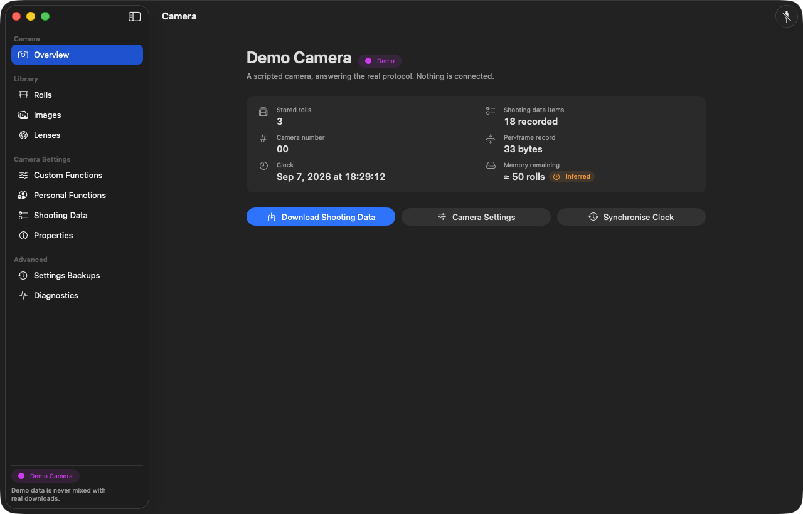
</p>

---

## Contents

- [Why this exists](#why-this-exists)
- [What it does](#what-it-does)
- [Screenshots](#screenshots)
- [Hardware: how to talk to an EOS-1V](#hardware-how-to-talk-to-an-eos-1v)
- [Install and build](#install-and-build)
- [Step-by-step guides](#step-by-step-guides)
  - [1. First connection](#1-first-connection)
  - [2. Download your rolls](#2-download-your-rolls)
  - [3. Add scans — the quick way](#3-add-scans--the-quick-way)
  - [4. Add scans — the advanced way](#4-add-scans--the-advanced-way)
  - [5. Fix a frame, add a lens, enrich the data](#5-fix-a-frame-add-a-lens-enrich-the-data)
  - [6. Write metadata into your files](#6-write-metadata-into-your-files)
  - [7. Change a Custom Function safely](#7-change-a-custom-function-safely)
  - [8. Personal Functions](#8-personal-functions)
  - [9. Choose what the camera records](#9-choose-what-the-camera-records)
  - [10. Back up, compare and restore camera settings](#10-back-up-compare-and-restore-camera-settings)
  - [11. Erase rolls from the camera](#11-erase-rolls-from-the-camera)
  - [12. When something goes wrong](#12-when-something-goes-wrong)
- [How writing to the camera is kept safe](#how-writing-to-the-camera-is-kept-safe)
- [What this project discovered](#what-this-project-discovered)
- [Side projects](#side-projects)
- [Architecture](#architecture)
- [Testing](#testing)
- [Repository layout](#repository-layout)
- [Limits, unknowns and honesty](#limits-unknowns-and-honesty)
- [Contributing](#contributing)
- [Licence and trademarks](#licence-and-trademarks)

---

## Why this exists

The EOS-1V is the last and most capable 35 mm SLR Canon made, and the only one
that records the exposure data of every frame it shoots. Getting that data out
of the camera was always the problem:

* **Canon ES-E1** shipped in 2000 with a 32-bit Windows kernel driver. Windows
  11 x64 cannot load it, the cable is long discontinued, and there was never a
  macOS version.
* **Meta35** replaced the cable but is closed, paid, requires an authenticated
  FTDI dongle, and is no longer developed.
* The community's Python tools work, but they are command-line utilities, not
  something you hand to a photographer.

This repository is the reverse-engineering record *and* a finished application
built from it. The camera protocol was re-derived from packet captures, Canon's
own driver binaries, and a real EOS-1V on the bench; the decoder is then
validated against Canon's own CSV exports of the same downloads, record by
record, on every build.

---

## What it does

| | |
|---|---|
| **Connect** | Native serial at 9600 8N1 over a Raspberry Pi Pico, an FTDI adapter, or any TTL serial port. Ports are identified, not guessed. |
| **Download** | Every stored roll, with per-roll and per-frame progress, cancellation, and permanent retention of the raw bytes. |
| **Decode** | Shutter, aperture, focal length, maximum aperture, ISO and ISO(M), exposure and flash compensation, shooting mode, metering, flash mode, film advance, AF mode, AF points, multiple exposures, bulb duration, timestamps. |
| **Library** | Rolls, exposures, images, lenses, film stocks, notes, tags, search, archive — all usable with no camera attached. |
| **Match** | Drag a folder of scans in; files are paired with exposures by filename number, by order, or by a fixed offset, and anything ambiguous is shown rather than guessed. |
| **Write metadata** | EXIF, TIFF, IPTC-in-XMP and a dedicated `eos1v` XMP namespace, written without recompressing a single pixel, verified by reading every file back. |
| **Camera settings** | All four Custom Function banks, Personal Functions 1–30, the shooting-data item list with Canon's 28-byte budget, camera number and clock. |
| **Safely** | Nothing is written because a control moved. Draft → diff → validate → your approval → automatic backup → write → read back → byte comparison. |

---

## Screenshots

> Captured from the running application.
> `docs/screenshots/` explains how to regenerate the whole set.

### Camera

| | |
|---|---|
|  | **Overview.** The interface is named and identified — Pico CDC, FTDI or generic — with the wiring caution attached to the port rather than buried in a manual. Roll count, remaining capacity, camera number and clock come straight from the camera. |
| 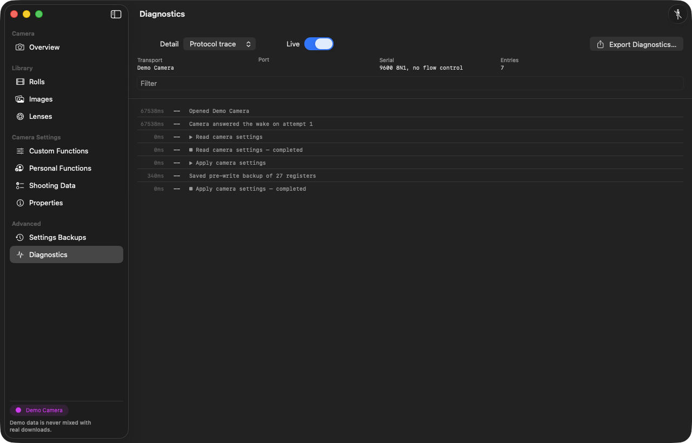 | **Diagnostics.** Every exchange with the camera, annotated with the operation it belongs to and exportable as a transcript — down to individual bytes in both directions at the *Protocol trace* detail level. This is the screen that found the protocol bug described below. |

### Library

| | |
|---|---|
| 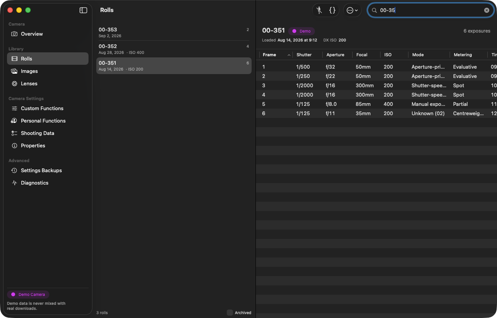 | **Rolls.** Film ID, loaded date, DX ISO and frame count. Select a roll to see its exposures in a sortable table; toggle **Raw data** to see the bytes the camera sent for each frame. |
| 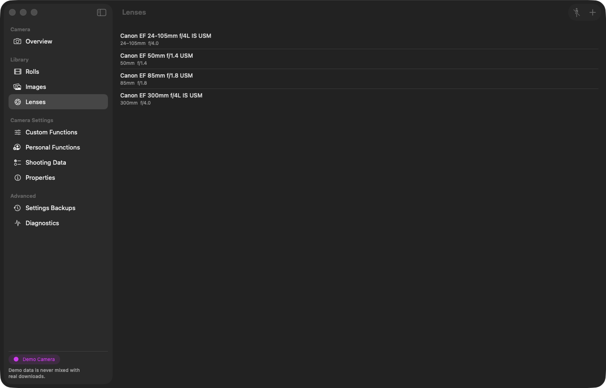 | **Lenses.** The camera records focal length and maximum aperture but never the lens name. The library suggests lenses that fit what the frame recorded; you confirm, and the name is written into EXIF. |

### Scans and metadata

| | |
|---|---|
| 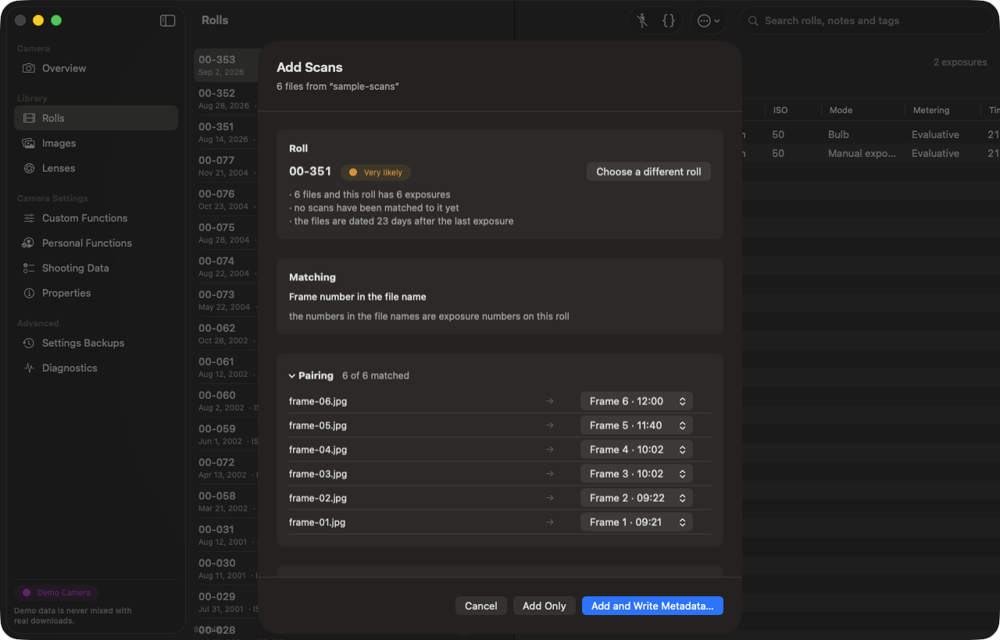 | **Add Scans.** Drop files anywhere on the window. One sheet: which roll, how the files line up, which exposure each file is, and what will be written. |
| 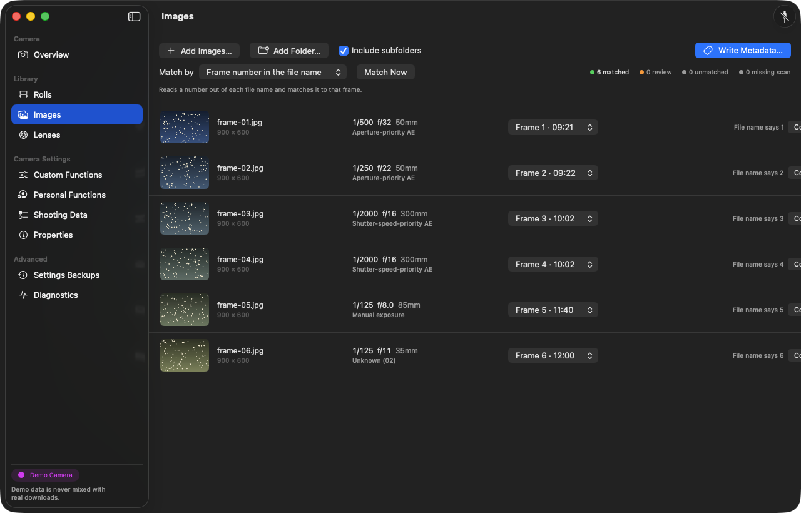 | **Images.** The advanced screen, for when the simple path is not enough: four matching strategies, manual re-pairing, and per-image confidence with the reason for it. |
| 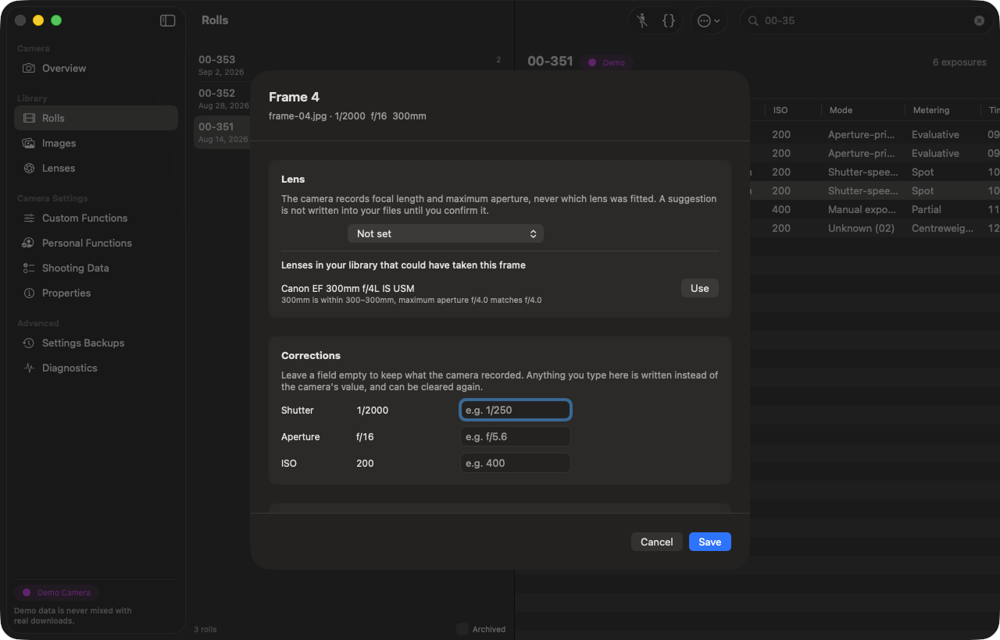 | **Frame inspector.** Double-click any exposure. The lens is suggested from what the frame recorded, *with the reason* — "300mm is within 300–300mm, maximum aperture f/4.0 matches f/4.0" — and stays a suggestion until you press **Use**. Override a value the camera got wrong, add notes, and see exactly what the camera recorded beside what will be written. |
| 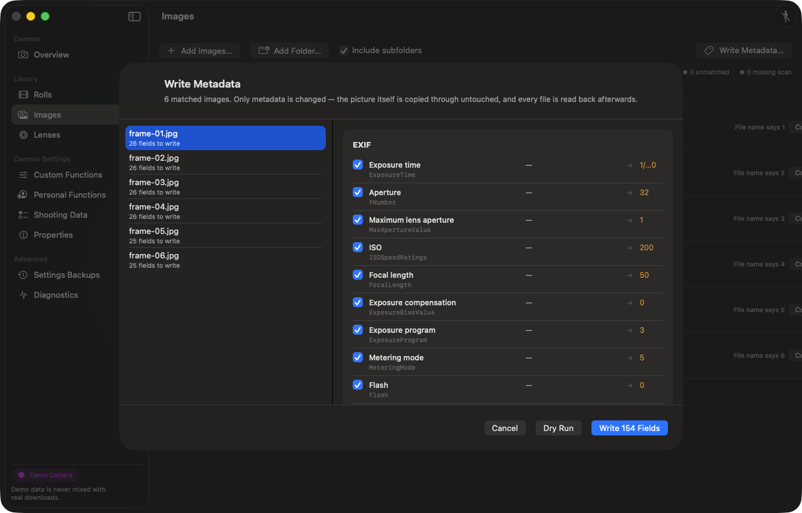 | **Metadata preview.** Per file, per field: current value, new value, and a checkbox. Dry-run first. The compressed image data is never touched. |

### Camera settings

| | |
|---|---|
| 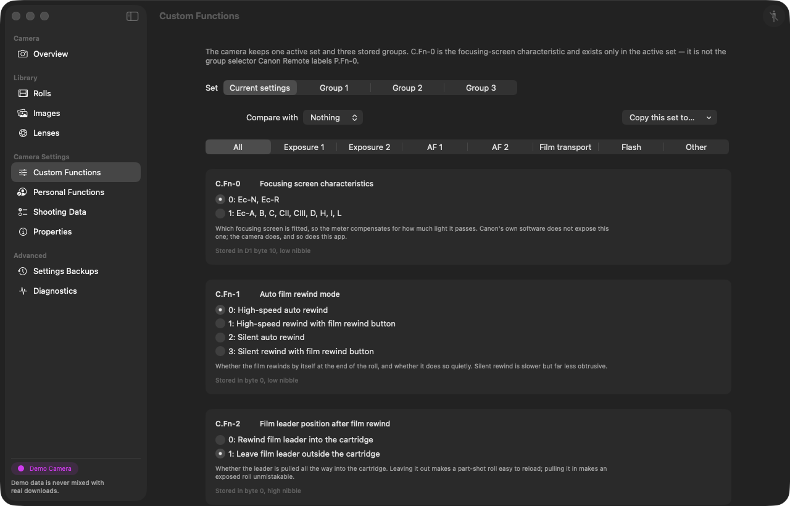 | **Custom Functions.** All 20 functions across four banks, with Canon's own descriptions from the manual. |
| 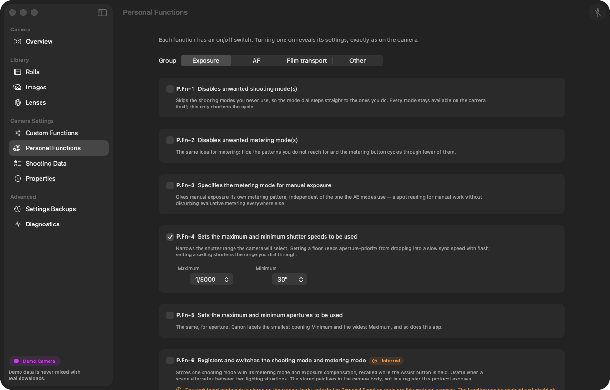 | **Personal Functions.** P.Fn 1–30, each with its enable flag, value editor and the caveats that apply to it. |
| 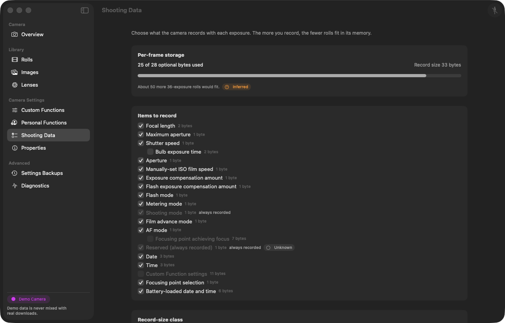 | **Shooting Data.** Choose which items the camera records per frame, with the 28-byte budget enforced live — the camera cannot store more, so the interface will not let you ask for more. |
| 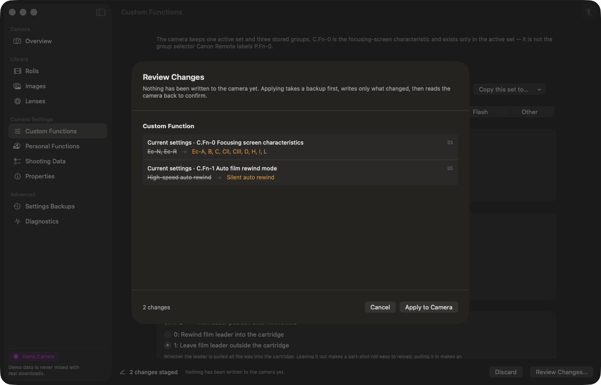 | **Review Changes.** Every write goes through this sheet: nothing has reached the camera yet, and you see each setting's old value and new value before it does. |
| 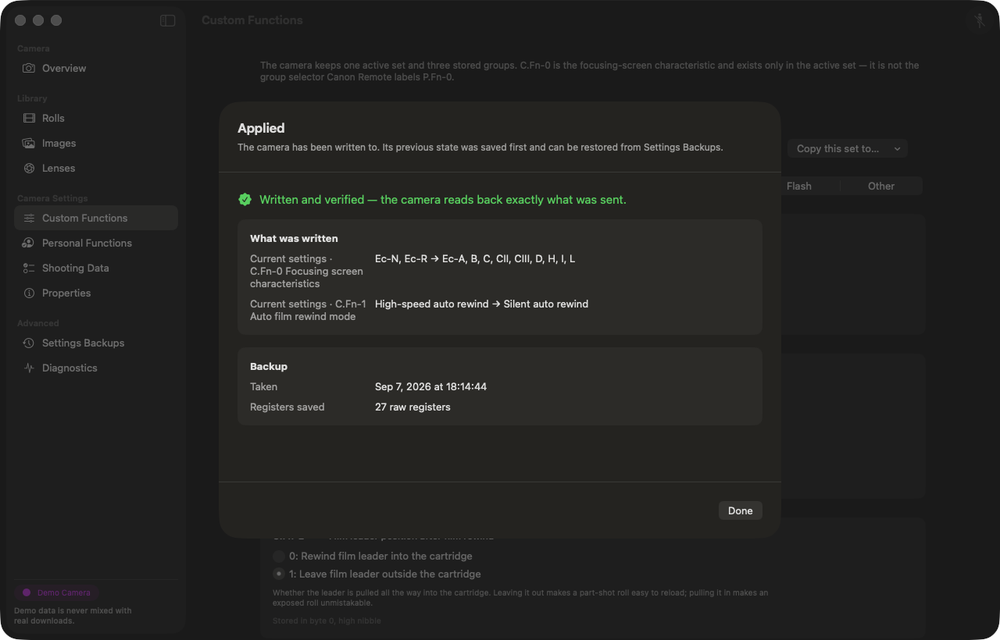 | **…and the result afterwards.** What was written, the backup that was taken first and how many raw registers it holds, and — the part that matters — whether the camera read back *exactly* what was sent. "Written and verified" and "acknowledged but not verified" are different answers and the app never conflates them. |

---

## Hardware: how to talk to an EOS-1V

The EOS-1V's data terminal is a **three-wire TTL serial port**: 9600 baud,
8 data bits, no parity, one stop bit, no flow control.

```
EOS-1V N3 sleeve  ──── GND
EOS-1V N3 tip     ───> adapter RX      (the camera transmits here)
EOS-1V N3 ring    <─── adapter TX      (the host transmits here)
```

### Read this before wiring anything to a camera you care about

* The **logical** polarity above is proven against a real body. The camera-side
  **voltage** is not. Measure the camera's TX line against sleeve with a
  known-good FT232 setup before connecting anything else.
* RP2040 GPIO is **3.3 V and not 5 V tolerant**. If the camera's line can reach
  5 V, level-shift or divide it before it reaches GP1.
* **Do not connect RS-232 voltage levels to the camera.** "Serial" here means
  TTL, not ±12 V. A MAX232-style adapter or a PC's DE-9 port will not do.
* The FT232R this work was done with has **no UART inversion** configured. Do
  not enable it.

The application shows the relevant caution next to the port it has found, rather
than assuming you have read this file.

### Supported interfaces

| Interface | Status | Notes |
|---|---|---|
| **Raspberry Pi Pico** with the CDC firmware | Supported — recommended | Appears as `/dev/cu.usbmodem*`, USB `04A9:3040`. See [Side projects](#side-projects). |
| **FT232 / FTDI** serial adapter | Supported | `/dev/cu.usbserial-*`. No Meta35 dongle authentication needed. |
| Any 9600 8N1 TTL serial port | Supported | Shown with a caution until you confirm the wiring. |
| Genuine Canon **ES-E1** cable | Not yet | The protocol and the cable's `[n][00]` bridge framing are implemented and unit-tested against the captured vendor-init sequence; claiming the USB vendor interface needs IOKit `IOUSBHostInterface` matching, which cannot be written blind. The interface says so instead of hiding it. |
| **Demo Camera** | Built in | A synthetic EOS-1V that answers the real protocol. Always labelled as demo. |
| **Session replay** | Built in | Replays captured sessions; used by the test suite. |

### Putting the camera into data mode

Open the side-button cover on the camera's left flank and press **M.Fn**
repeatedly until `PC` appears on the top LCD. The camera must be in this state
for anything below to work. It drops out of `PC` mode on its own if left idle,
which usually explains a connection that worked a minute ago.

---

## Install and build

### Requirements

* macOS 14 or later
* **Xcode 16 or later** — not just the Command Line Tools. CLT alone ships
  neither XCTest nor swift-testing, so `swift test` cannot run under it. If
  `xcode-select -p` prints a CommandLineTools path, either
  `sudo xcode-select -s /Applications/Xcode.app/Contents/Developer` or set
  `DEVELOPER_DIR` for the build.

There are no other dependencies. `Package.swift` has an empty dependency list.

### Build

```bash
git clone <this-repo>
cd "Canon EOS 1V Reverse ReBuild/EOS1V"

swift build                    # library and executable
swift test                     # the full test suite
Scripts/make-app.sh            # assemble "EOS-1V Companion.app" (debug, ad-hoc signed)
Scripts/make-app.sh --release  # release build
open "build/EOS-1V Companion.app"
```

Xcode opens the package directly — double-click `EOS1V/Package.swift`.

### Signing and notarisation

```bash
Scripts/make-app.sh --release \
  --sign "Developer ID Application: Your Name (TEAMID)" \
  --notarize "your-notarytool-keychain-profile"
```

The bundle is built with the hardened runtime, `com.apple.security.device.usb`
and user-selected file access. It is deliberately **not** sandboxed — see
`docs/ENGINEERING_DECISIONS.md` ED-8 for the reasoning.

---

## Step-by-step guides

### 1. First connection

1. Wire your adapter to the camera's N3 data terminal as shown above, and plug
   it into the Mac.
2. Put the camera in `PC` mode (M.Fn until `PC` shows on the top LCD).
3. Open **EOS-1V Companion**. The **Overview** screen lists the ports it found.
4. Pick your interface. The app names what it recognises — *Pico CDC*, *FTDI* or
   *generic serial* — and shows the USB identity and device path so you can
   confirm it is the right one.
5. Press **Connect** (or **Camera ▸ Connect**).

If it works you get the camera number, its clock, how many rolls it holds and
how much recording space is left. If it does not, the message says which step
failed — the camera never answered the wake byte, the reply failed its checksum,
the port was busy — rather than a generic failure.

> **No camera to hand?** Choose **Demo Camera** in the interface list. It answers
> the real protocol from a scripted session: three rolls, a multiple exposure, a
> long lens, a Bulb frame, a manual ISO override, varied metering, an
> intentionally unrecognised enum value, and non-default C.Fn and P.Fn. Demo
> rolls are stored against a camera record marked `isDemo` and are labelled
> **Demo** everywhere in the library. They are never mixed with a real download.

### 2. Download your rolls

1. Connect (above).
2. **Camera ▸ Download Shooting Data**.
3. Watch the progress: roll by roll, then frame by frame within each roll.
   Cancel at any point — what has already arrived is kept.

What is stored:

* the decoded exposure record for every frame;
* the **raw 33-byte `E3` film header** for every roll;
* the **raw `E4` payload** for every frame;
* the roll's **recording mask**, which is what makes those raw bytes
  re-decodable.

That last point matters. If the decoder improves in two years, **Re-decode**
re-reads rolls you downloaded today with the new decoder, without disturbing
anything you edited by hand. Nothing the camera said is ever discarded to save
space.

Downloading does **not** erase anything from the camera — see
[guide 11](#11-erase-rolls-from-the-camera).

### 3. Add scans — the quick way

This is the fast path, and the one to learn first.

1. **Drag a folder of scans anywhere onto the window.** (Or **File ▸ Add
   Scans…**.)
2. The **Add Scans** sheet opens and tells you which roll it thinks they belong
   to, *and why*: "the file names contain film ID 00-077", or "36 files, and
   00-077 is the only roll with 36 unscanned exposures". If it is not certain it
   says so and offers the alternatives.
3. It then shows how it intends to line the files up — by the number in the file
   name, by a fixed offset, or simply in order — again with the reason.
4. Expand **Pairing** to check or correct any individual file. Files do **not**
   have to be in order, and the numbering does not have to start at 1. Anything
   you correct by hand is marked *Paired by you* and is never re-guessed.
5. Choose:
   * **Add Only** — register the scans against the exposures and stop.
   * **Add and Write Metadata…** — go straight on to the metadata preview.

Multiple exposures are handled explicitly: several records legitimately share
one frame number, and the sheet shows them as a group rather than treating the
duplicate as an error.

### 4. Add scans — the advanced way

The **Images** screen is the full version of the same job, for awkward cases:
partial scans, rolls scanned in two sessions, mixed file types, or a lab that
numbered the frames its own way.

1. Select the roll on the **Rolls** screen, then go to **Images**.
2. Add files or folders (drag them in, or use the add button).
3. Choose a **matching strategy**:
   * **File-name number** — take the number out of the file name
     (`_MG_0031.tif` → 31).
   * **File-name number with offset** — the same, plus a constant. For a lab
     that started at 0, or a strip scanned from frame 12.
   * **In order** — sort the files and lay them onto the exposures in sequence.
   * **Manual** — pair everything yourself.
4. Every row shows a confidence and the reason for it. Ambiguity is displayed,
   never resolved silently.
5. Re-pair any row from its pop-up menu. Manual pairs survive a strategy change.

### 5. Fix a frame, add a lens, enrich the data

**Double-click any exposure row** — on the Rolls screen or the Images screen —
to open the frame inspector.

* **Lens.** The camera records focal length and maximum aperture, never the lens
  name. The inspector suggests lenses from your library that fit what the frame
  recorded (a 24 mm at f/4 maximum fits a 24-105 f/4L; it does not fit a
  50 f/1.4). Suggestions stay suggestions until you press **Confirm**; only then
  is the lens treated as fact and written into EXIF as `LensModel`.
* **Corrections.** Override shutter, aperture or ISO when the camera's record is
  wrong — a manual lens the body could not read, a pushed roll, a body whose
  clock had drifted. Overrides are stored *beside* the camera's value, never on
  top of it: the inspector always shows both.
* **What the camera recorded.** The unedited decode, plus the raw bytes, plus
  anything the decoder could not interpret. Nothing is hidden because it was
  inconvenient.
* **Notes.** Free text, searchable, and written to `dc:description` if you want
  it in the file.

Manage the lens list itself on the **Lenses** screen: name, focal range, maximum
aperture and notes. Right-click ▸ **Remove** (or select and press Delete)
deletes a lens and clears it from every frame that used it, in a single
transaction.

### 6. Write metadata into your files

1. Select a roll (or the images you want) and choose **Write Metadata…**.
2. The preview lists **every file** and **every field**: what the file has now,
   what will replace it, and a checkbox to exclude any field you disagree with.
3. Press **Dry Run** to prove the whole batch resolves without touching a byte.
4. Press **Write**.

What is written:

| Group | Examples |
|---|---|
| EXIF | `ExposureTime`, `FNumber`, `ISOSpeedRatings`, `FocalLength`, `MaxApertureValue`, `ExposureProgram`, `MeteringMode`, `Flash`, `ExposureBiasValue`, `DateTimeOriginal`, `LensModel`, `BodySerialNumber` |
| TIFF | `Make`, `Model`, `ImageDescription` |
| IPTC (via XMP) | headline, description, keywords, creator |
| `eos1v` | film ID, frame number, roll notes, film stock, push/pull, lab, the raw AF-point bytes, multiple-exposure grouping, and every value the decoder read that EXIF has no home for |

The `eos1v` namespace is `http://oakman.photo/ns/eos1v/1.0/`, prefix `eos1v`.
`docs/XMP_NAMESPACE.md` documents every property.

How it is written:

* **The picture is never re-encoded.** The compressed image data is copied
  through untouched. A test in the suite hashes the JPEG entropy-coded segment
  before and after a write and fails if a single byte moved.
* **Atomic replacement.** The new file is built beside the old one and swapped
  in; an interrupted write cannot leave you with half a file.
* **Every file is read back** after writing and compared field by field.
  "Written and verified" and "write acknowledged but verification failed" are
  different outcomes, and the app reports which one you got, per file.
* **Batches continue past a failure** and tell you exactly which files failed
  and why, rather than stopping halfway with no report.

JPEG, TIFF and PNG are supported. TIFF and PNG can additionally be rebuilt when
a first-pass write does not verify; a JPEG never is, because rebuilding a JPEG
container is not worth the risk to your only scan.

### 7. Change a Custom Function safely

1. Connect, then **Camera ▸ Read Camera Settings**.
2. Open **Custom Functions**. All 20 functions are listed for all four banks,
   with Canon's own description of each setting.
3. Change whatever you like. **Nothing has been sent to the camera.** You are
   editing a draft.
4. Press **Review Changes**. The sheet shows:
   * which registers will change, with old bytes and new bytes;
   * which registers are being backed up first;
   * anything that failed validation, and why.
5. Press **Apply**. The app then, in order:
   1. writes a full raw-register backup into the library;
   2. writes **only the registers that actually changed**, in Canon's own order
      (`D2`, `D6`, `D8`, `DA`), at ES-E1's measured cadence;
   3. re-reads every register it wrote;
   4. compares the bytes.
6. The result is stated plainly: **written and verified**, or **acknowledged but
   verification failed** — with the registers that disagreed.

### 8. Personal Functions

P.Fn 1–30 work the same way, with three extra rules the hardware imposes:

* Each P.Fn has an **enable flag** in the `D3` register, mirrored into `DD`.
  Setting a value without enabling it does nothing on the camera, so the
  interface treats the two as one control.
* **P.Fn-27 and P.Fn-30 share the `CF` bitfield.** Changing one rewrites the
  byte that carries the other, so both are always read, merged and written
  together.
* **P.Fn-6** (registered shooting-mode pair) is stored in the camera body,
  outside the registers this protocol exposes. The enable bit is read and
  written; the interface tells you the pair itself must be set on the camera.

### 9. Choose what the camera records

The EOS-1V has **28 bytes per frame** for optional shooting data, and that is a
hard limit in the camera, not a policy in this app.

1. Open **Shooting Data**.
2. Tick the items you want recorded. The remaining budget updates as you go, and
   an item that will not fit is disabled with an explanation rather than
   silently ignored.
3. Sub-items nest exactly as they do in ES-E1 — switching off a parent switches
   off its children.
4. **Review Changes**, then **Apply**, as above.

Changing this affects **future** frames only. Rolls already in the camera keep
the mask they were shot with, which is why each roll's mask is stored alongside
its raw bytes.

### 10. Back up, compare and restore camera settings

**Settings Backups** holds every snapshot the app has taken — including the
automatic one it takes before every write.

* **Compare** any two snapshots, or a snapshot against the camera as it is now.
  The diff is at register and byte level.
* **Restore** a snapshot: the same staged flow applies. You see the diff, you
  approve it, only changed registers are written, and everything is read back.

Snapshots are raw register bytes, not the app's interpretation of them. A
snapshot taken today can be restored by a future version that understands more
of the protocol than this one does.

### 11. Erase rolls from the camera

Erasing is deliberately awkward.

1. Choose **Erase Shooting Data**.
2. The confirmation tells you **how many rolls in the camera are not yet in your
   library**. If that number is not zero, it is what you are about to lose.
3. Confirm.
4. The app re-reads the roll count afterwards and reports what the camera
   actually says, rather than assuming the command worked.

### 12. When something goes wrong

**Diagnostics** shows the full annotated transcript of every exchange with the
camera: timestamp, direction, bytes, and which command each byte belongs to.
**Export** writes it to a text file.

Common cases:

| Symptom | Usual cause |
|---|---|
| Camera never answers the wake byte | Not in `PC` mode, or it has timed out of it. Press M.Fn again. |
| Answers, then stops mid-download | Battery. The EOS-1V is not gentle with a tired battery when the data port is active. |
| Nothing in the port list | The adapter is not a serial device (some cheap boards enumerate as HID), or macOS has no driver for it. |
| Wake succeeds, every read fails its checksum | Wiring polarity, or a marginal voltage level on the camera's TX line. |
| Reads work, writes report "not verified" | A genuine mismatch. The app does not round this off. Read the register list in the result. |

---

## How writing to the camera is kept safe

These are not preferences. They are the rules the code is built around.

1. **A UI control never writes anything.** Editing a control edits a draft. A
   write happens only when you press Apply on a diff you have seen.
2. **Only changed registers are written,** in Canon's own order, at ES-E1's
   measured cadence: 12 ms between registers, a 75 ms commit gap after registers
   1, 5, 9 and 13, and 10 ms from a command byte to its data block. EEPROM cells
   are finite; the app does not spend them rewriting bytes that already hold the
   right value.
3. **Reserved and unknown bits are preserved.** A register is read, the known
   fields are replaced, and everything else is written back exactly as it came.
4. **An automatic raw backup precedes every write.**
5. **Every write is read back and compared byte for byte.** "Verified" and
   "acknowledged" are never conflated.
6. **A plain timeout never causes a resend.** The `E3` and `E4` iterators
   advance a pointer inside the camera; re-sending one would silently skip a
   roll or an exposure, and the loss would be invisible. A resend happens only
   in answer to a standalone not-ready `F4`, with a 40 ms race guard.
7. **Anything the protocol does not confirm is not writable.** Where a value can
   be read but not safely written, the interface says *"Unsupported — protocol
   not yet confirmed"* and gives the reason. There are no placeholder controls.

The governing principle, stated once in `docs/SOURCE_OF_TRUTH.md` and applied
everywhere: **unknown is better than wrong.**

---

## What this project discovered

Full write-ups, with the evidence and the regression test that guards each one,
are in `docs/NEW_PROTOCOL_FINDINGS.md`.

### The camera misses a command sent while it is still replying

The most important finding, and it took a real body to see it.

Neither the specification nor any prior tool says how soon after a reply the
host may send its next command. The Python tools send immediately. That works —
until it doesn't:

```
 88ms  TX  D5                       C.Fn group 1
100ms  RX  D5 0A 11 11
111ms  RX  11 01 9A
111ms  TX  D7                       <- 0 ms turnaround
119ms  RX  D7 0A 11 11 11
131ms  RX  01 9A
131ms  TX  D9                       <- 0 ms turnaround
149ms  RX  11 01 9A
149ms  TX  D3                       <- 0 ms turnaround
3155ms !!  timeout command=D3 elapsed=3000ms
```

Three commands at a zero-millisecond turnaround were answered; the fourth drew
**total silence** — no not-ready, no partial frame, no checksum error. Which
command failed moved between runs, and the same operation succeeded on retry,
which rules out any per-register cause. A camera that has *received* a command
either answers it or reports itself busy; silence means the command byte was
never received at all.

**The conclusion:** the camera cannot receive a command byte while it is still
finishing its own transmission. ES-E1's 12 ms inter-register gap had always been
read as a property of *writing*. It is not. It is the turnaround the camera
needs, and ES-E1 pays it everywhere.

The app now enforces that gap before every command — including the resend that
answers a not-ready, which the hardware trace showed going out in the same
millisecond as the `F4` that prompted it. The sync echo stays exempt: it is an
acknowledgement owed immediately, not a new command.

### `0x10` is the manual-focus flag in the AF-mode byte

The specification says to decode `raw & 0xBF`; the reference tool masks
`raw & 0x3F`. Across 1,983 records correlated with Canon's own export, **both
rules fail** — 43 records decode to "unknown" under either.

The AF byte takes eight values in the captures. Bit `0x10` is set on exactly the
five that Canon labels *Manual focus* and clear on exactly the three it does
not, whatever the low mode bits do:

```
if raw & 0x10      -> Manual focus
else if raw & 0x04 -> AI Servo AF
else if raw & 0x02 -> One-Shot AF
else               -> unknown, raw byte preserved
```

Zero exceptions across every correlated record. Bits `0x40` and `0x80` remain
unexplained; they are masked off for the decision and preserved in the stored
byte.

### Bulb duration is recorded on every frame and means nothing outside Bulb

Once the item is enabled, the two bulb bytes appear on **every** record, reading
`0x0000` on ordinary frames. Since `seconds = raw + 1`, a naive decoder presents
every frame you ever shot as a one-second bulb exposure. Canon's own export
leaves the column blank unless the mode is Bulb — and so does this app, while
still keeping the raw bytes.

### The record layout is compositional, and the mask alone predicts it

Each frame record carries one mask bit per recorded byte, a 3-byte prefix, and
`0xFF` padding up to a 9-, 17- or 33-byte tier. Counting set bits in the mask
predicts the record length exactly:

* mask `FF FF 0C 3F 00 08 00 3F` → 29 bytes + 3 prefix = 32, in a 33-byte record
  with exactly one pad byte — i.e. 27 optional bytes, the figure the
  specification cites for that roll, reached here from the mask alone.
* mask `FF FF 0C 3F 00 08 7F 00` → 30 + 3 = 33 with no padding, and the `E4`
  length byte reads `0x21` = 33.

Two masks, two field sets, both predicted. Unnamed mask bits are *counted*, so
the fields after them stay at the right offset, but never labelled.

### The decode is validated against Canon's own exports on every build

All **54 rolls and 1,883 exposure records** of the `canon-dataload-nodelete`
capture are decoded and compared column by column against Canon's own CSV export
of that same download — frame number, focal length, maximum aperture, Tv, Av,
ISO(M), exposure compensation, flash compensation, shooting mode, metering mode,
flash mode, film advance, AF mode.

**Zero mismatches, in every column, on every build.** That test also
independently confirms `Tv = (raw − 20) / 4`, `Av = 2^(raw/8)`,
`ISO = 50 × 2^((raw − 0x40)/8)`, Canon's 1/3-stop display ladders, exposure
compensation being blanked in Manual and Bulb, and that the shooting mode's low
two bits are a burst counter rather than mode information.

### Corrections to the inherited research

`docs/SOURCE_OF_TRUTH.md` records every place two sources disagreed and which
one won. Among them: `F9` is the camera ID, not a clock-register selector; `DD`
mirrors P.Fn-16 and P.Fn-21; `DD` byte 4 is not the constant it was thought to
be; the focus-point field names were reversed; the `E3` film-ID byte positions
were wrong; the film-advance table was incomplete.

---

## Side projects

Two pieces of hardware and Windows work came out of this and are published
separately. The material lives in
[`Raspberry Pico Firmware Clone of ES-E1/`](Raspberry%20Pico%20Firmware%20Clone%20of%20ES-E1/).

### A Raspberry Pi Pico that *is* an ES-E1 cable

An RP2040 firmware that keeps Canon's ES-E1 USB identity but replaces its
obsolete driver ABI with standards-compliant **USB CDC ACM**:

| | |
|---|---|
| VID / PID | `04A9` / `3040` — Canon's own |
| Manufacturer | `CANON INC.` |
| Product | `Canon EOS USB Cable` |
| Interface | `Canon EOS Port`, CDC class/subclass `02/02` |
| Camera side | UART0 at 9600 8N1 — GP0 → N3 ring, GP1 ← N3 tip, GND → sleeve |

Because it advertises CDC ACM, Windows 10 and 11 bind Microsoft's signed in-box
`Usbser.sys` automatically and **no third-party kernel driver is needed at
all** — which is the whole problem with the original cable on a modern machine.
macOS and Linux see an ordinary modem device. The on-board LED is repurposed as
a host→camera TX activity indicator with a non-blocking, retriggerable 40 ms
pulse, so it never perturbs the serial timing.

Total cost of the interface: a small microcontroller and a three-conductor
cable.

### A patch that makes Canon's own `Remote.exe` work on Windows 11

Getting the port to appear is only half the job. Canon's `Remote.exe` still
could not find the camera, and disassembly explained why.

`Remote.exe` reads `HKLM\HARDWARE\DEVICEMAP\SERIALCOMM` and accepts a port only
when **characters 8–10 of the registry value name — immediately after
`\Device\` — are literally `EOS`**. Canon's old kernel driver published
`\Device\EOS.comm### = COMx`; Microsoft's `usbser.sys` publishes
`\Device\USBSER### = COMx`. A perfectly working port is discarded on a
three-character string comparison.

The patch is four edits to one binary:

| Offset | From | To | Why |
|---|---|---|---|
| `0x1C090` | `EOS\0` | `USB\0` | the discovery discriminator |
| `0x16DAB` | `KEY_ALL_ACCESS` | `KEY_READ` | discovery does not need write access |
| `0x16F4B` | `KEY_ALL_ACCESS` | `KEY_READ` | " |
| `0x170EF` | `KEY_ALL_ACCESS` | `KEY_READ` | " |

The later `KEY_ALL_ACCESS` uses are left alone deliberately: those write the
application's own preferences under HKCU. The three that were changed are
discovery-only, and changing them also removes the pointless requirement to run
the old application as Administrator.

The patch script verifies the input's SHA-256 before touching a byte, validates
every byte it is about to overwrite, keeps a `.pre-win11-patch` backup, and
verifies the output hash afterwards. It refuses to run on any other build.

Also documented there: why Canon's original driver package cannot be revived at
all. `EOSmdm.sys` and `EOScmnt.sys` are PE32 **i386 kernel** binaries dated
2002, which a 64-bit Windows 11 kernel cannot execute and which modern
code-signing policy would reject anyway. Rewriting the INF changes neither
limitation. Replacing the transport is the only honest fix.

---

## Architecture

```
┌──────────────────────────────────────────────────────────────┐
│ EOS1VApp          SwiftUI, @Observable, NavigationSplitView   │
│                   native menus, drag and drop, VoiceOver      │
├──────────────────────────────────────────────────────────────┤
│ EOS1VCore                                                     │
│   Protocol        EOSSession — framing, checksums, the retry  │
│                   contract, turnaround, transcripts           │
│   Transport       POSIX serial · IOKit discovery · replay ·   │
│                   demo camera         (all behind one actor)  │
│   Decoder         mask-driven record layout, APEX scales,     │
│                   Canon display ladders                       │
│   Settings        C.Fn banks · P.Fn 1–30 · recording mask     │
│   Persistence     SQLite, user_version migrations             │
│   Metadata        ImageIO, atomic replace, verification       │
│   Matching        scan↔exposure strategies, roll suggestion   │
├──────────────────────────────────────────────────────────────┤
│ CSQLite           system-library target (no ORM)             │
│ CImageIOGuard     ObjC++ firewall around ImageIO             │
└──────────────────────────────────────────────────────────────┘
```

Two details worth calling out.

**Camera access is a Swift actor.** One operation at a time, queued. The
protocol engine never learns which transport it is talking to, which is what
makes the replay transport and the demo camera possible without a single
`#if DEBUG` anywhere in the protocol code.

**`CImageIOGuard` is an ObjC++ exception firewall.** Apple's ImageIO uses
Adobe's XMP toolkit internally, and a malformed XMP packet makes it throw a C++
exception. Swift cannot catch those: the process calls `std::terminate` and dies
with signal 6, taking unsaved work with it. Every ImageIO metadata call in this
app therefore goes through a C++ template that catches the throw one stack frame
below ImageIO, inside C++, and returns a failure the Swift side reports as an
ordinary error. A corrupt sidecar in a folder of scans becomes one file marked
failed, not a crash.

---

## Testing

```bash
cd EOS1V && swift test
```

**181 tests in 25 suites**, using swift-testing.

The suite covers protocol framing and the retry contract, the mask-driven record
layout, the decoder against Canon's ground-truth exports, C.Fn and P.Fn encoding
including every correction in `docs/SOURCE_OF_TRUTH.md`, write byte-output,
ordering and pacing, read-back verification, persistence and migrations,
metadata mapping and pixel preservation, scan matching, and roll suggestion.

Named regression tests guard the findings that took hardware to establish, so a
future refactor cannot quietly undo them:

* `testDoesNotResendFrameCommandOnPlainTimeout`
* `"A command is never sent while the camera is still talking"`
* `"An iterator that draws silence is never re-sent"`
* `testF4InsidePayloadIsNotTreatedAsSync`
* `testAFModeManualFocusBitOverridesLowBits`
* `testAFModeMatchesCanonExportAcrossAllRecords`
* `testDecoderMatchesCanonExportForEveryRecord`
* `testRecordLengthPredictedFromMaskAlone`
* `testPFn16EnableUpdatesBothD3AndDD`
* `testUnknownMaskBitDoesNotShiftKnownFields`
* `testBulbDurationOnlySurfacesInBulbMode`

The replay transport can inject nine distinct fault modes — silence, truncation,
checksum corruption, spurious not-ready, missing acknowledgement and others — so
the retry contract is tested against misbehaviour, not only against success.

---

## Repository layout

```
EOS1V/                       the application
  Sources/EOS1VCore/         protocol, transport, decoding, library, metadata
  Sources/EOS1VApp/          SwiftUI application
  Sources/CSQLite/           SQLite system-library target
  Sources/CImageIOGuard/     ObjC++ ImageIO exception firewall
  Tests/EOS1VCoreTests/      test suite and capture fixtures
  Scripts/                   app bundling and icon generation
  Legacy/                    pre-rebuild sources, kept for reference
docs/                        engineering documentation (below)
EOS1V_REVERSE_ENGINEERING_*  the research this is built on — never edited
Canon Tool/                  packet captures of ES-E1 / Remote.exe, and Canon's
                             own CSV exports of the same downloads
Meta35 Software/             captures of Meta35, for comparison
Others Reverse Engineering/  prior community work
Tool Screenshots/            ES-E1 / Remote.exe screens, for parity checking
Raspberry Pico Firmware…/    the Pico firmware and the Windows 11 patch
_agent/                      development build harness; safe to delete
```

**On third-party binaries.** The packet captures, the CSV exports and every
analysis in this repository are original work and are published here. Canon's
and Meta35's own executables, DLLs, drivers, installers and help files are
**not** redistributed — `.gitignore` keeps them out. To reproduce a capture you
need your own licensed copy of the software concerned.

### Documentation

Engineering documentation is kept separate from these end-user instructions:

| File | What it is |
|---|---|
| `docs/SOURCE_OF_TRUTH.md` | What is known, how well, and every place two sources disagreed and why one won |
| `docs/NEW_PROTOCOL_FINDINGS.md` | Discoveries made while building this, with evidence and tests |
| `docs/PROTOCOL_IMPLEMENTATION.md` | The wire protocol as implemented |
| `docs/FEATURE_PARITY_MATRIX.md` | Capability by capability against ES-E1, Meta35 and the Python tools |
| `docs/ES_E1_PARITY_AUDIT.md` | Screen-by-screen audit against the original Canon application |
| `docs/ENGINEERING_DECISIONS.md` | Why the architecture is what it is |
| `docs/IMPLEMENTATION_STATUS.md` | What works, what does not, what is unknown |
| `docs/XMP_NAMESPACE.md` | The `eos1v` metadata namespace, property by property |

The reverse-engineering material at the repository root is the historical
record. It is never edited — corrections are documented in `SOURCE_OF_TRUTH.md`
instead, with the reasoning.

---

## Limits, unknowns and honesty

Everything below is surfaced in the application rather than hidden.

| Area | State |
|---|---|
| Genuine ES-E1 USB cable | Protocol and bridge framing implemented and tested; the USB vendor-interface claim is not written, because it cannot be written blind |
| `E7` record-size class | The `08`/`10`/`20` tier mapping is inference. The app displays the predicted tier, re-sends only the byte the camera reported, and never writes a tier |
| 45-point AF result map | The bit-to-point mapping has never been calibrated. Stored and written as labelled hex at unknown confidence |
| P.Fn-6 registered mode pair | Lives in the camera body, outside the exposed registers. The enable bit is handled; the pair must be set on the camera |
| P.Fn-25 byte 4 | Preserved verbatim, not editable, explained in the interface |
| `F6`, `A1`, `F1` bytes 0 and 2 | Semantics unknown. Read, stored, shown as labelled hex |
| IPTC IIM | Only `Iptc4xmpCore` fields with a clean XMP equivalent are written; the legacy IIM block is not synthesised, because writing one into a file that has none would rewrite container structure the app otherwise leaves alone |

Fourteen open protocol questions are listed in `docs/IMPLEMENTATION_STATUS.md`.
None of them prevents the application from being useful, and none of them is
guessed at in order to fill a gap in the interface.

There is no telemetry, no analytics, no cloud sync and no remote API. The
application talks to your camera, your files, and one SQLite database in
`~/Library/Application Support/EOS1V/`. That is all it talks to.

---

## Contributing

The most valuable contribution is **evidence**. A packet capture of an operation
nobody has captured yet closes an open question permanently; a guess does not.

If you have an EOS-1V and an interface:

* captures of the 9- and 17-byte record tiers would close OQ-2 and OQ-14;
* a P.Fn-27 toggle made from Canon's own software would close OQ-6;
* an AEB frame would close OQ-8;
* a calibrated 45-point AF capture — a frame shot with one known point
  selected — would close OQ-10 and OQ-11.

**Diagnostics ▸ Export** produces a transcript in the right form.

Code contributions are welcome. Please keep the rules in
[How writing to the camera is kept safe](#how-writing-to-the-camera-is-kept-safe),
and add a named regression test for anything a future refactor could quietly
undo.

---

## Licence and trademarks

An independent project by **Oakman**. Not affiliated with, endorsed by, or
supported by Canon Inc.

"Canon", "EOS", "EOS-1V" and "ES-E1" are trademarks of Canon Inc., used here
only to describe the hardware this software communicates with. No Canon
software, driver, firmware or artwork is included or redistributed by this
application.

Use it on your own camera at your own risk. The safety rules above exist because
the author values his own EOS-1V — but no amount of read-back verification makes
writing to a 25-year-old EEPROM entirely risk-free.
